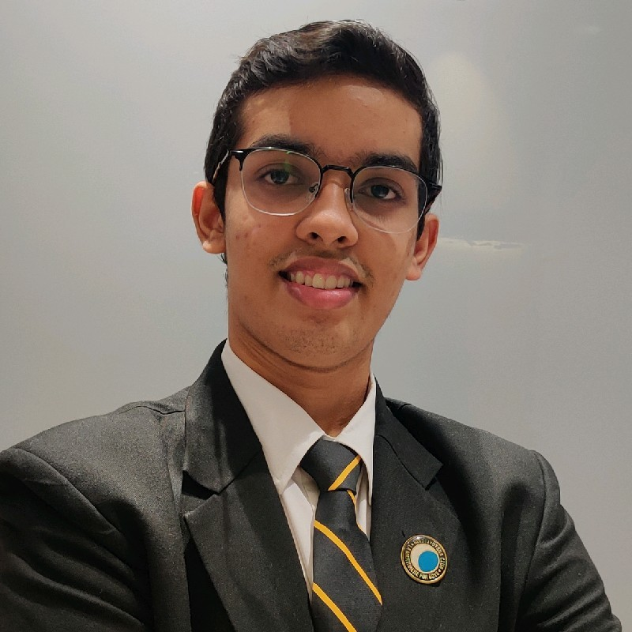

# **Nishant Begani**

> :telephone_receiver: (424)946-5024 :email: nbegani@ucsd.edu 

[LinkedIn Profile](linkedin.com/in/nishant-begani-5450181ab)



[Education](#Education) [TechnicalSkills](#Technical_Skills)

## _Introduction_

My skills include software development and testing. I also am involved in making projects involving data analysis and web development. I am Seeking an internship to enhance my technical skills and gain industry-level experience. A dedicated, inquisitive problem-solver, with strong leadership and teamwork skills, I thrive in collaborative environments.

```
print("My favourite programming language is C++")
```

## _Education_
### Major in Mathematics and Computer Science & Minor in Data Science 
> University of California, San Diego

:calendar: 09/2021 - ongoing 

## _Technical Skills_
- JAVA 
- C++
- C
- Swift
- MATLAB
- R 
- JavaScript
- React

## _Relevant Coursework_ 

1. Advanced Data Structure 
2. Analysis of Algorithms 
3. System Architecture
4. Discrete Mathematics
5. Graph Theory 
6. Modern Abstract Algebra 

> [These are the technical skills I want to learn](Learning.md)


